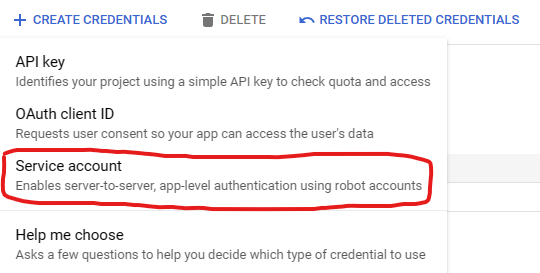

# GameServerUtilities

## Developer(s)
- Aleksey Panas

## About
This repository contains an assortment of utilities that I made to manage video game servers that I run on my own hardware. Examples of utilities found in this repo include cloud backup scripts and remote 
console scripts. I made these utilities for myself and I did not test them extensively across platforms. Under each section, I will indicate where and how I tested and ran the script.

The best this about these utilities is that they are entirely usable from the terminal, and they were made for Linux. ARK, for example, has many Windows desktop utilities
for server management, such as Arkon and ASM. However, there aren't as many resources for Linux, especially ones that don't require a GUI. 

Enjoy :)

## Arkrcon
This folder contains a basic python RCON client. The client is built following the protocol as outlined at https://developer.valvesoftware.com/wiki/Source_RCON_Protocol. The script was written with the intention to use it 
for an ARK server, however it should work for any game that supports the linked protocol (such as Rust)

To run the script, simply execute `arkrcon.py` with python >= 3.11. You must provide exactly 3 arguments in order or `server_ip`, `server_port`, `rcon_password`. The full command
would look as follows: 
```
python3 ./arkcon.py <server_ip> <server_port> <rcon_password>
```
For ARK, the RCON password is your server's admin password.

The script, if opened, includes a docstring at the top of the file with rough steps to set up an ARK server on Linux (I did
it on Gentoo specifically, but it should be very similar on other distros)

This python script should work across platforms since it uses only standard python libraries and nothing platform-specific. 

The included shell scripts (`config.sh` and `start_rcon_client.sh`) will obviously only run on Linux. They are there so that
I don't have to enter the ip, port, and password each time. I run `start_rcon_client.sh` which pulls the variables
defined in the config via the `source` command, and then runs python as indicated above.

Once you execute the python script, it will attempt to connect via TCP to the RCON server. As soon as it does, it
will send the first packet which includes the rcon password. All server replies are captured and printed, so you 
should immediately see a type 2 response which indicates the password has been approved (see link from earlier on RCON protocol)

Then you will be provided with 3 commands:
- input `i` and you will be provided with a prompt to enter a command.
  - This command is meant to be an in-game command to be executed in the game server's console (e.g `saveworld` for ARK would save the game world)
- input `q` to disconnect from rcon and exit the script
- input `s` to be prompted for a list of additional ports. **This is ARK specific. If you are using this for another game, ignore this feature**
  - This command is intended to save and shutdown multiple servers if you are running an ARK cluster on the same machine
  - You already connected to RCON via some port, but if you have multiple servers, you need to specify the additional ports of those servers
  - The script will then issue the `saveworld` and `doexit` commands on all servers you provided, including the main one, and will exit the script


## ServerBackup
This folder contains a google drive backup python script. When ran, it will read or prompt you to generate a config. With that config
it will call the google drive API to upload a specified server game saves folder to google drive

Currently, this script only supports ARK. However, a very minor tweak could be made to generalize it. Currently it only searches for
a folder called `Saved`, which is ARK specific. You can easily change this in the code, or even in the generated config file afterwards. If the need
arises, I might update the script to be more general.

The script should safely work on any platform with python >= 3.11, but it was only tested and used on Gentoo Linux

The `install.sh` script include a `pip install` command to install python dependencies. If on windows, simply extract
the pip command from the shell script and run it yourself on windows. It should work the same, maybe with a minor tweak

With dependencies installed, run the script like so:
```
python3 ./backup.py
```
Here is some pre-requisite information you will need before running the script
### Google API
In order to upload content to google drive, you need access to the API. I personally used a Service Account, so I will share how to set that up. There are other ways if you want to figure them out

1. Create a Google project by visiting https://console.cloud.google.com/. You'll need to complete the OAuth consent screen which is available in the dashboard once the project is made


2. Go to the Credentials tab (seen in image above) and create a new credential. Select "Service Account".


3. Once created, go to the page of the service account and visit the tab to create and download JSON credentials


4. Download and save the JSON file into the same directory as the `backup.py` script
5. On google drive, create and share a folder with the service account (via its email). This is where your backups will be uploaded

### Script Placement
Place the script in any directory as long as it is fairly close to the directory which you'll be backing up to the cloud. The script is made
to automatically scan up and down the directory tree to look for the target directory. One of the config options specifies the max
search depth. So, if you place the script too far and set the depth too small, it will fail to find the directory

### Script & Config Info
If the config file doesn't exist (which it initially won't), the script will guide you interactively through making one,
so no need to worry.

The script first gathers the following information, whether it be from an existing config, or by prompting you:
1. Max number of backups. This indicates how many folders you want on google drive before it starts deleting old ones
2. Directory search depth specifies how far up and down to search for the target upload directory. If the depth is 2, it will go up 2 folders and search down 4 folders (totalling to a depth of 2 in both directions)
   1. The script will prompt you if there are multiple target directories found
   2. Currently it searched for any directory named `Saved`, which is ARK specific. Simply changing instances of this in the script can be a duct tape solution to use this for other games
3. Once it finds the `Saved` folder, it will save the path in the config to not have to look again. If the location changes, delete the config to regenerate it, or change it in the config file
4. The script will lastly look for a `.json` file in the script's directory. This JSON file must contain the private key info to the service account for Google
5. Finally, the script will upload the folder to google drive. Once uploaded, it will delete an older backup if the current number of folders in the drive exceeds your configured max backup.
